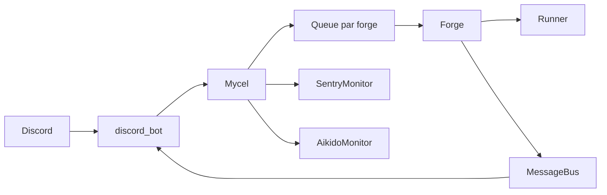

# Mycel — documentation technique

## 1. Objectif

Mycel est un orchestrateur multi-agents piloté par Discord pour le développement assisté par IA (AIDD). Un canal Discord est associé à une **forge** ; l’utilisateur envoie une **tâche** (ticket Jira, incident Sentry, URL de merge request, etc.). Mycel enchaîne des **étapes** (invocation de prompts) exécutées par des **agents** (CLI : Claude Code, Gemini, Cursor Agent) en sous-processus, avec journalisation sur un **bus** et persistance d’état par forge.

Le réseau **Mycel** relie des **Forges** ; chaque forge exécute un **Workflow** (suite d’étapes) ; chaque étape est exécutée par un **Agent**.

## 2. Architecture

### 2.1 Chaîne d’exécution

```
discord_bot.py
    → mycel.py      (files d’attente par forge, routage, reload, monitors)
        → forge.py  (workflow, étapes parallèles, git, cache, echo reviewer)
            → runner.py (sous-processus, stdin = prompt, streaming)
    → message_bus.py → Discord (fil, streaming, boutons)
```

- **`mycel.py`** : charge `mycel_config.yaml` et `spells.yaml`, construit les instances `Forge`, une file `asyncio.Queue` par forge, worker async qui dépile et lance `Forge.run_workflow` (ou étape isolée / reprise). Gère `reload_config()`, disponibilité des agents, branchement des monitors.
- **`forge.py`** : machine d’état d’un workflow, étapes séquentielles ou **groupe parallèle** (`parallel:` dans le YAML du workflow), hooks `pre_run` / `post_run`, préparation git / worktrees, validation de sortie, métriques, feedback revue (`{reviewer_feedback}`).
- **`runner.py`** : `ClaudeRunner`, `GeminiRunner`, `CursorRunner` avec repli possible, parsing usage tokens / coût depuis stderr Claude, répertoire de travail = dépôt workspace.
- **`message_bus.py`** : pub/sub async, persistance des messages en JSONL sous `bus/`.
- **`discord_bot.py`** : commandes préfixées `!`, slash commands, permissions par rôle, fils de discussion, tableau de bord épinglé, boutons interactifs.
- **`sentry_monitor.py`** / **`aikido_monitor.py`** : tâches de fond optionnelles (polling + option auto-enqueue des forges `sentry` / `aikido`).

### 2.2 Diagramme logique



## 3. Files d’attente et cycle de vie (`Mycel`)

- Chaque forge possède une file d’objets `_QueueItem` (tâche, instructions optionnelles, éventuellement `spell_name` pour étape isolée ou `from_spell` pour reprise).
- Un worker async traite un élément à la fois **par forge** (pas de chevauchement de deux rituels sur la même forge).
- Le hot-reload (`reload_config`) recharge YAML et met à jour `forge.spells` ; les forges nouvellement déclarées dans le YAML peuvent être instanciées sans redémarrage du bot.

## 4. Forge : workflow, parallèle, état

### 4.1 Workflow

Le workflow est la liste `ritual:` dans la config de la forge. Chaque élément est soit le nom d’une étape (chaîne), soit un dictionnaire `parallel: [step1, step2, ...]` exécuté via `asyncio.gather` dans `forge.py`.

### 4.2 Persistance

- Répertoire par forge : `bus/<nom_forge>/`.
- **`state.json`** : état du workflow (y compris clés historiques `current_skill`, `step_outputs`, `skill_metrics` pour compatibilité).
- Sorties par run : sous `bus/<forge>/runs/<run_number>/` selon la logique de sauvegarde des sorties.
- Le bus append des lignes JSON (JSONL) pour l’historique consultable via `!… log`.

### 4.3 Statuts typiques

Le forge fait évoluer `state["status"]` (idle, running, paused, completed, error, etc. selon implémentation) ; les tests dans `tests/test_forge_workflow.py` illustrent la persistance après complétion.

## 5. Runners (`runner.py`)

- Prompt envoyé sur **stdin**, pas en argument CLI (évite la fuite de contenu sur la ligne de commande).
- **Streaming** : découpage par lots pour rappeler `on_output` (Discord).
- `RunnerResult` agrège stdout, stderr, code retour, `token_usage` dérivé de stderr pour Claude.
- Convention projet : ne pas injecter `ANTHROPIC_API_KEY` dans l’environnement du runner (auth gérée par le CLI Claude comme prévu par l’équipe).

## 6. MessageBus

- `MessageBus.subscribe(callback)` pour les abonnés (bot Discord).
- `publish` place un `Message` dans une `asyncio.Queue` ; boucle de dispatch vers les callbacks.
- Si le bus n’est pas démarré, les messages peuvent être ignorés (avertissement log).

## 7. Configuration — `mycel_config.yaml`

Fichier principal (nom legacy supporté : `dispatch_config.yaml` si le nouveau fichier est absent).

| Zone | Rôle |
|------|------|
| `repos` | Carte clé logique → nom de dossier du clone sur disque. |
| `workspace_groups` | Groupe : `base_env` (variable d’environnement = racine des clones), liste `repos`, option `git_worktree`. |
| `defaults` | `familiar` (agent), `max_retries`, `timeout` par défaut. |
| `claude` | Ex. `allowed_tools`, `permission_mode` passés au CLI. |
| `sentry_monitor` / `aikido_monitor` | `enabled`, `interval`, `auto_fix`, listes de niveaux / sévérités. |
| `permissions` | Rôles Discord → liste de forges autorisées (ou `all`). |
| `forges` | Nom de forge → `channel`, `workspace_group`, `familiar` (agent), `ritual` (workflow), option `on_complete`, `description`, surcharge `git_worktree`. |

Les canaux sont des **noms** résolus par le bot vers des IDs Discord.

## 8. Steps — `spells.yaml`

Fichier principal (fallback : `skills.yaml`). Clé racine `spells:` (legacy : `skills:`).

Champs fréquents par étape :

| Champ | Rôle |
|-------|------|
| `prompt` / `prompt_file` | Texte du prompt ; `prompt_file` charge un fichier externe et peut substituer `$ARGUMENTS` par `{task}` et `{instructions}`. |
| `runner` / `command` | Agent (`claude`, `gemini`, `cursor`) et éventuelle commande slash associée. |
| `timeout` | Délai du sous-processus. |
| `runner_kwargs` | Surcharge (ex. `allowed_tools: null` pour une étape). |
| `auto_advance`, `next_on_pass`, `next_on_fail`, `pass_condition` | Pilotage de la suite du workflow selon la sortie. |
| `pre_run` / `post_run` | Commandes shell optionnelles. |
| `git_prepare` / `git_finalize` | Hooks git de l'étape. |
| `required_fields` | Validation de champs dans la sortie (JSON). |

Les prompts utilisent des **variables de template** (voir section 9).

## 9. Variables de template et entrées utilisateur

Variables courantes : `{task}`, `{instructions}`, `{previous_output}`, `{step_output_<nom>}`, `{step_summary_<nom>}`, `{reviewer_feedback}`, `{pre_run_output}`, `{post_run_output}`, `{mr_project}`, `{mr_iid}`, `{jira_id}`, `{issue_context}`, `{forge_name}`, `{workspace}`, etc.

### Quatre chemins d’entrée vers le prompt

1. **Tâche initiale** — `!<forge> <texte libre>` : stocké dans `state["task"]`, expose `{task}` ; extraction `{jira_id}` par regex `\b([A-Z][A-Z0-9]+-\d+)\b` ; `{issue_context}` via fichiers locaux (`DOCS_PATH` / `ISSUES_DIR`).
2. **Instructions de commande** — `step`, `from`, `resume`, `retry` : texte additionnel → `state["instructions"]` / extensions `_extra_instructions` → `{instructions}`.
3. **Message libre dans le fil** (sans préfixe `!`) : buffer RAM `_feedback_buffer`, flushé dans `{instructions}` au prochain rendu de prompt ; **non persisté** dans `state.json` (perte si crash avant l’étape suivante).
4. **Rejet d’une revue** : extraction dans `state["reviewer_feedback"]`, consommé au prochain prompt cible puis réinitialisé.

Cas limites documentés dans l’ancienne version : absence d’ID Jira, message pendant une étape en cours (appliqué à l’étape **suivante**), placeholders manquants `(non disponible)` pour certains `step_output_*`.

## 10. Journalisation

Préfixes de loggers : `mycel.core`, `mycel.forge`, `mycel.agent`, `mycel.bus`, `mycel.discord`, `mycel.sentry`, `mycel.aikido`.

## 11. Variables d’environnement (.env)

Typiquement : `DISCORD_BOT_TOKEN`, clés/API pour Gemini si utilisé, `WORKSPACE_*` alignés sur `workspace_groups` (ex. `WORKSPACE_REMEDIATION`), `DOCS_PATH`, `ISSUES_DIR`, `REMEDIATION_AUTO_FIX` (`true`/`false` — peut surcharger le comportement `auto_fix` des monitors pour poster un bouton « fix » au lieu d’enqueuer automatiquement).

## 12. Vérifications locales

```bash
python3 -m pytest tests/ -v
python3 -m py_compile mycel.py forge.py runner.py discord_bot.py message_bus.py sentry_monitor.py aikido_monitor.py
```

## 13. Rétrocompatibilité

- Alias de commande globale : `!dispatch` → `!mycel`.
- Synonymes de sous-commandes : `forges`/`workflow`/`circles`, `steps`/`spells`/`skill`/`skills` ; dans une commande forge : `step`/`spell`/`skill`.
- Fichiers et clés YAML legacy comme indiqué ci-dessus.
- `state.json` conserve les noms de clés historiques (`current_skill`, etc.) pour ne pas casser les déploiements existants.

## 14. Documentation complémentaire

- `CLAUDE.md` : guide concis pour les contributeurs / assistants de code.
- `GUIDE_UTILISATEUR.md` : mode d’emploi Discord et cas d’usage pour les utilisateurs finaux.
